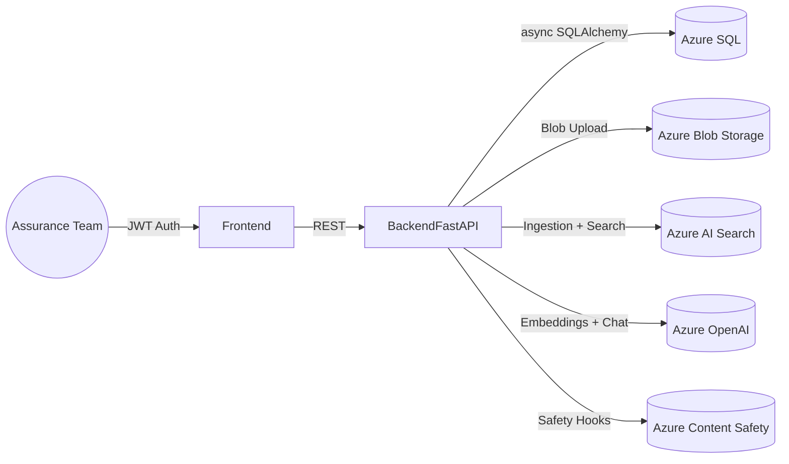
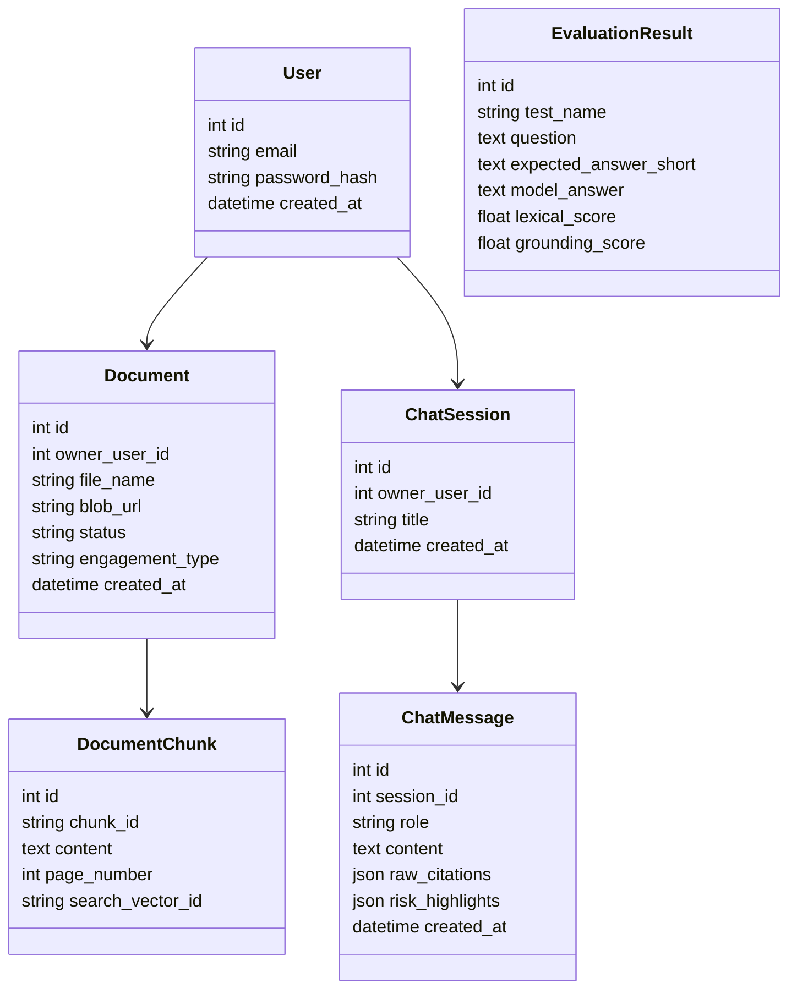

# Assurance Insight Copilot

A portfolio-ready Retrieval-Augmented Generation (RAG) assistant tailored for mid-market Canadian accounting and advisory firms. The platform helps internal practitioners upload engagement documents, index them in Azure AI Search, and interact with a safety-aware copilot that surfaces insights with citations and risk highlights.

## Target Audience & Value
- **Internal assurance, tax, and advisory teams** that need faster access to engagement intelligence.
- **Canadian mid-market firms** standardizing on the Microsoft Cloud (Azure OpenAI, Azure AI Search, Azure SQL, Azure Storage).
- **Applied AI hiring managers** looking for production-ready patterns across ingestion, retrieval, evaluation, and DevOps.

## Key Capabilities
- Secure authentication with hashed passwords + JWT sessions.
- Document upload pipeline: Blob storage, text extraction, chunking, embeddings, and Azure AI Search indexing.
- Hybrid retrieval (vector + keyword) feeding Azure OpenAI chat completions with structured JSON (answer + citations + risk highlights).
- Safety controls (input validation + Azure Content Safety stub) and evaluation telemetry persisted in Azure SQL.
- Terraform/IaC, Dockerized backend, GitHub Actions CI (to be expanded in subsequent tasks) for repeatable delivery.

## Architecture Overview


## Domain Model Snapshot


## RAG Pipeline
1. **Ingestion** (`backend/app/documents/ingestion.py`)
   - Files (PDF/DOCX/CSV/TXT) saved to Blob Storage or a local fallback.
   - Text extracted via `pypdf`, `python-docx`, or CSV/txt readers.
   - Chunks built with overlap, embedded via Azure OpenAI (mocked locally), and indexed into Azure AI Search.
2. **Retrieval** (`backend/app/chat/rag_pipeline.py`)
   - Hybrid retriever queries Azure AI Search; falls back to SQL `LIKE` queries when offline.
   - Retrieved chunks converted into structured citations and prompt context.
3. **Generation**
   - Azure OpenAI chat completion instructed to return JSON: `{answer, risk_highlights, citations}`.
   - Local mock response mimics the same contract for offline development.
4. **Safety & Risk Highlights**
   - Input validation + stubbed Azure Content Safety guardrails.
   - Risk highlights either provided by the model or heuristically inferred from chunk contents.

## Setup Instructions
1. **Prerequisites**
   - Python 3.11+
   - Node.js 18+ (frontend to be added next)
   - Azure subscription (optional for local dev due to mocks)
2. **Environment Variables** (`backend/.env`)
   ```bash
   ENVIRONMENT=local
   DATABASE_URL=sqlite+aiosqlite:///./assurance_insight.db
   AZURE_OPENAI_ENDPOINT=https://your-openai.openai.azure.com
   AZURE_OPENAI_API_KEY=changeme
   AZURE_OPENAI_CHAT_DEPLOYMENT=gpt-4o-mini
   AZURE_OPENAI_EMBEDDING_DEPLOYMENT=text-embedding-3-large
   AZURE_AI_SEARCH_ENDPOINT=https://your-search.search.windows.net
   AZURE_AI_SEARCH_API_KEY=changeme
   AZURE_STORAGE_CONNECTION_STRING=DefaultEndpointsProtocol=...
   AZURE_STORAGE_CONTAINER=documents
   JWT_SECRET_KEY=super-secret
   ```
3. **Backend**
   ```bash
   cd backend
   python3 -m venv .venv && source .venv/bin/activate
   pip install -e .
   python app/db/init_db.py   # creates SQLite schema
   uvicorn app.main:app --reload
   ```
4. **Tests**
   ```bash
   cd backend
   pytest
   ```

## Example Usage Walkthrough
1. Register/login via `/api/auth/register` or `/api/auth/login` to obtain a JWT.
2. Upload an engagement document at `/api/documents/upload`; check status with `/api/documents`.
3. Create a chat session (`POST /api/chat/sessions`), then send a message to `/api/chat/sessions/{id}/messages`.
4. Inspect the assistant response, citations, and risk highlights—each message is persisted for auditability.

## Evaluation & Safety
- **Evaluation**: Offline scripts (to be completed in subsequent steps) will call the full RAG pipeline and log lexical + grounding metrics in the `evaluation_results` table.
- **Safety**: Input validation, deterministic mock outputs, and Azure Content Safety hooks ensure only domain-appropriate answers are returned. Each answer cites source documents and pages to discourage hallucinations.

## Roadmap
- Build the React/Tailwind frontend, elevating UX for documents and chat.
- Add Terraform definitions + GitHub Actions workflows for CI/CD.
- Implement the evaluation CLI with bundled sample questions.
- Harden safety (actual Azure Content Safety calls, policy-driven refusal handling).
